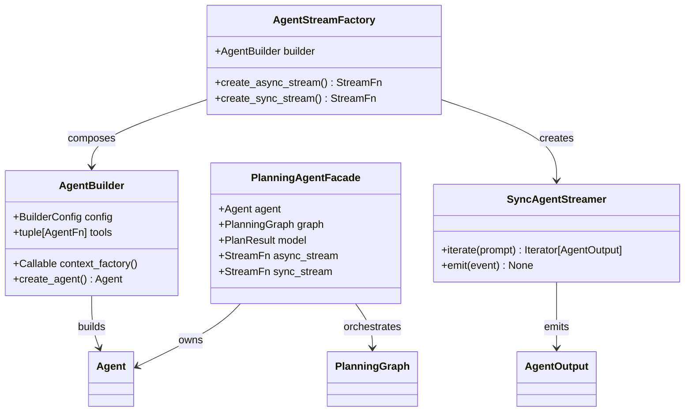
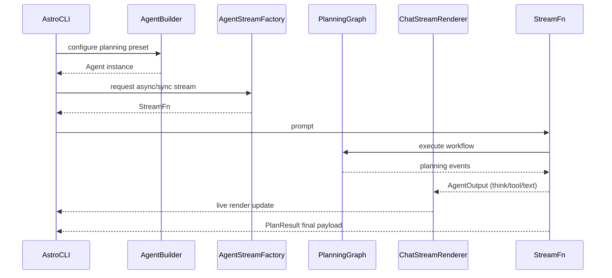

# Planning Agent Implementation Plan

## Goals
- Provide a reusable agent-builder abstraction that encapsulates model creation, context wiring, tool registration, and output typing.
- Support both asynchronous and synchronous streaming adapters that emit `AgentOutput` events, keeping downstream renderers unchanged.
- Introduce a planning agent capable of returning structured plans (e.g., a Pydantic model) while optionally producing natural-language summaries for end users.
- Leverage `pydantic-graph` to orchestrate deterministic planning steps while remaining compatible with existing Astro streaming utilities.

## Architectural Overview

### High-Level Modules
- `astro/agents/factory.py`
  - `AgentBuilder`: configurable factory that assembles `Agent` instances with shared defaults (model settings, instruction templates, base contexts).
  - `AgentStreamFactory`: coordinates creation of async and sync stream adapters.
- `astro/agents/planning.py`
  - `PlanStep`, `PlanResult`: structured Pydantic models describing plan outputs.
  - `create_planning_agent(...)`: convenience function that returns the planning agent, its stream adapter(s), and associated metadata.
- `astro/streams/sync.py`
  - `SyncAgentStreamer`: synchronous iterator mirroring the async streaming contract (`AgentOutput` events).
  - Normalises graph execution callbacks into `AgentOutput` variants.
- `astro/graphs/planning.py`
  - `PlanningGraph`: reusable `pydantic_graph` workflow defining plan stages (gather context, draft plan, validate, summarise).
  - Exposes event hooks for both streaming adapters.

### UML Sketch (ASCII)
```
+---------------------+        +-----------------------+
| AgentBuilder        |        | AgentStreamFactory    |
|---------------------|        |-----------------------|
| +config: BuilderCfg |        | +builder: AgentBuilder|
| +tools              |<------+| +create_async_stream()|
| +context_factory    |        | +create_sync_stream() |
+----------+----------+        +-----------+-----------+
           |                               |
           v                               v
+---------------------+        +-----------------------+
| PlanningAgent       |        | SyncAgentStreamer     |
|---------------------|        |-----------------------|
| +agent: Agent       |        | +iterate(prompt)      |
| +graph: PlanningGraph|       | +emit(event)          |
| +models: PlanResult |        | +listeners            |
+----------+----------+        +-----------+-----------+
           |                               |
           v                               v
   astro.app.chat_stream         astro.app.chat_stream
```

### Mermaid Views





## Implementation Steps
1. **Create Builder Configuration**
   - Define `BuilderConfig` dataclass holding defaults (model id, temperature, instruction templates, tool registry).
   - Implement `AgentBuilder.create_agent(...)` to call existing `create_agent(...)` under the hood.
   - Provide hooks for injecting custom `RunContext` or `ChatContext` factories.

2. **Generalise Stream Creation**
   - Refactor `create_agent_stream(...)` into a method on `AgentStreamFactory`.
   - Introduce `create_sync_stream(...)` that wraps a synchronous `agent.run_sync()` or graph iterator, yielding `AgentOutput` events using a shared adapter.
   - Ensure both async and sync paths normalise events through a central helper (`EventAdapter`) to keep block rendering logic untouched.

3. **Planning Graph Integration**
   - Use `pydantic_graph` to define `PlanningGraph` steps: requirements gathering, option generation, evaluation, final plan emission.
   - Hook graph callbacks into the stream adapter so each step emits `AgentThink` (for internal reasoning) and `AgentToolCall`/`AgentToolReturn` (for sub-steps and validations).
   - Expose structured `PlanResult` containing ordered `PlanStep`s (task, rationale, dependencies, expected duration).

4. **Planning Agent Facade**
   - Build `create_planning_agent(...)` that:
     - Instantiates `AgentBuilder` with planning-specific instructions and tools.
     - Wires the planning graph and registers event handlers.
     - Returns tuple(s) for async/sync streams, plus helpers to convert `PlanResult` into user-facing Markdown summaries.

5. **Rendering Adjustments (Optional)**
   - Update `ChatStreamRenderer` (if desired) to detect `PlanResult` and render it with a dedicated block (table or list) when the stream completes.
   - Provide CLI command (`/plan`) that invokes the planning agent via the sync or async stream depending on execution context.

6. **Testing and Validation**
   - Unit-test `AgentBuilder` to ensure configuration overrides work and errors bubble via `_loggy` helpers.
   - Add integration tests that run a short planning session, capturing emitted events for both async and sync flows.
   - Verify that final structured plans serialise correctly and render in the CLI without extra whitespace.

## Process Notes
- Maintain separation between internal reasoning (think blocks), tool execution, and final narrative output so existing UI components remain reusable.
- Keep structured outputs immutable (Pydantic `BaseModel` with `frozen=True`) to align with repo conventions.
- Document builder presets in `docs/agents.md` (follow-up task) to help contributors add new agent types without duplicating setup code.
- When rolling out the synchronous streamer, ensure it adheres to the same `StreamFn` signature so CLI and future GUIs can switch adapters transparently.

## Next Milestones
1. Implement `AgentBuilder` and associated config types.
2. Extract shared event-adapter logic for async/sync streams.
3. Prototype the `PlanningGraph` using `pydantic_graph` with mock steps.
4. Integrate the planning agent into CLI (`/plan`) and verify rendering.
5. Add documentation and examples demonstrating both structured plan output and conversational summary.
